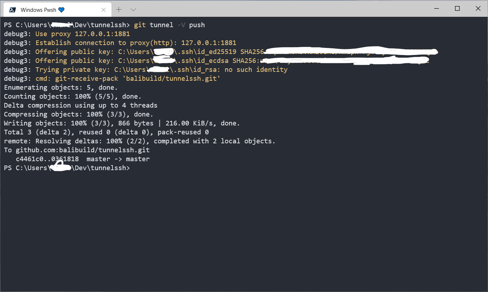
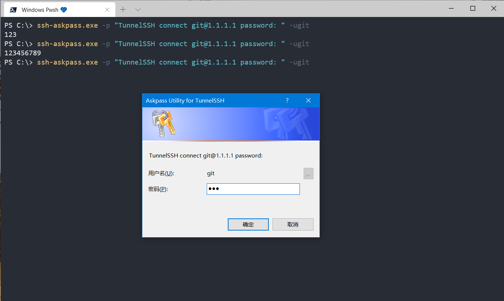

# Tunnel SSH Client

A witty ssh client that automatically accesses a remote server through a proxy


## Git Over SSH integration

Using the following command, we can use Git SSH traffic to pass through the proxy after turning on the proxy:

```shell
TUNNEL_DEBUG=1 git-tunnel clone git@github.com:bailbuild/tunnelssh.git
```

## Snapshot



TunnelSSH ssh-askpass:



## Develop

Note that because ssh-askpass needs to link the application **manifest** to support **TaskDialog**, [bali](https://github.com/balibuild/bali) needs to be used to build tunnelssh.
